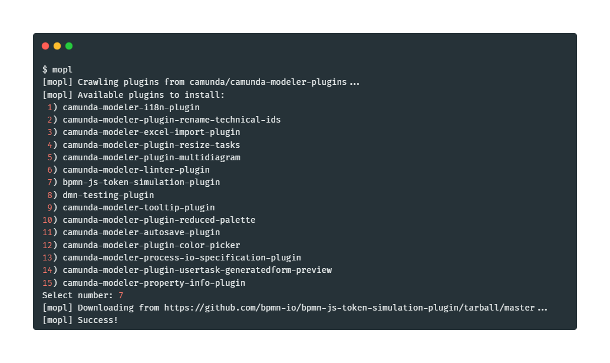

# mopl

mopl (***mo***deler ***pl***ugins) is a command line tool to easily install [Camunda Desktop Modeler plugins](https://github.com/camunda/camunda-modeler-plugins).



## Requirements

* Bash 4

## Installation

```sh
git clone https://github.com/pinussilvestrus/mopl.git
cd mopl/
```

## Usage

```sh
# [mopl] Usage: mopl -hvnlo
mopl -h

# list installed plugins
mopl -l

# install from registry
mopl

# install specific plugin
mopl -n bpmn-js-token-simulation-plugin 

# install to specific directory
mopl -o some/local/path 
```

## Additional Resources

* [Plugins documentation](https://docs.camunda.io/docs/components/modeler/desktop-modeler/plugins/)
* [Plugins list](https://github.com/camunda/camunda-modeler-plugins)

## License

MIT
